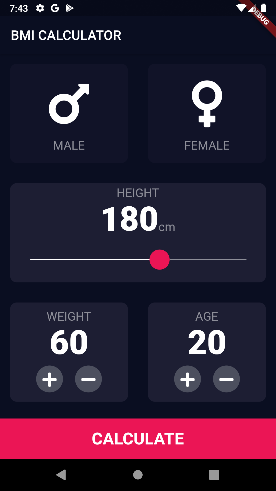

# BMI Calculator
This is an elegant BMI calculator built with Flutter. It's a cross-platform application that supports Android API 29 and iOS 12 (possible support for iOS 13). 

  

## Build instructions
You'll need the latest Flutter SDK, and either the latest Android SDK or iOS build tools  along with a simulator or ADB installed in order to build the app. Once configured
1) `git clone`
2) run `flutter pub get` or open `pubspec.yaml` and click on `get dependencies`
3) Enjoy

